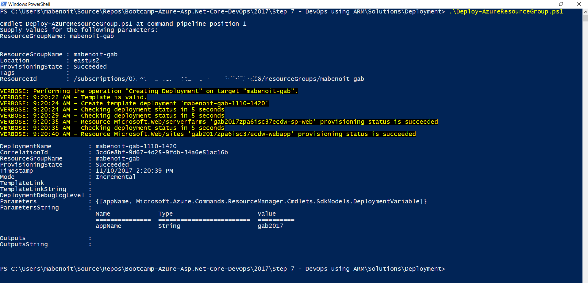
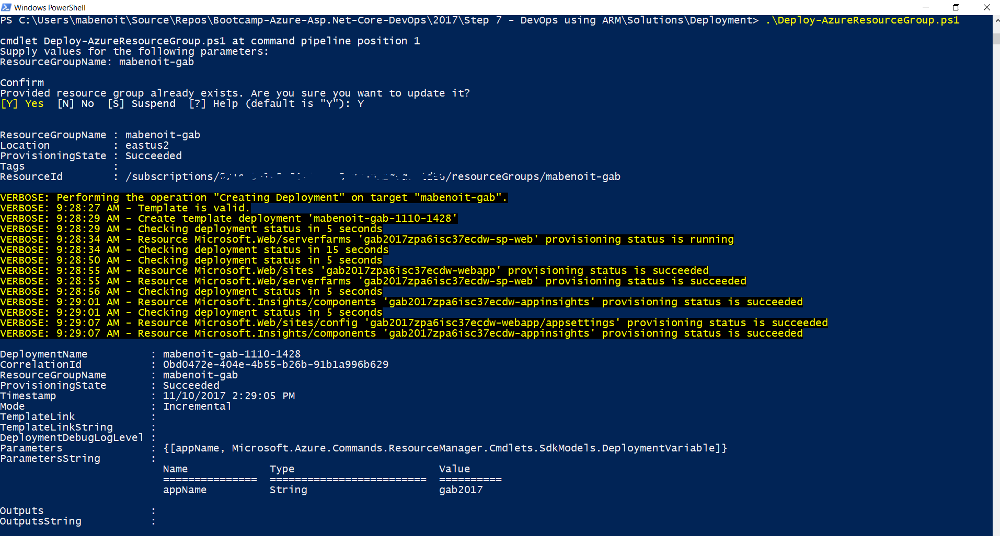

# Goal
Automate the creation of the resources required by the application in Azure using Infrastructure as Code (IaC) using Visual Studio Resource Group project. For doing that, we'll start from an empty resource group template project in Visual Studio and add to it to cover all the Azure resources found in the previous steps.

# Requirements
* Azure PowerShell v3.7.0 or later. Get it [here](https://github.com/Azure/azure-powershell/releases/tag/v3.7.0-March2017).

# Reference
* https://docs.microsoft.com/en-us/azure/azure-resource-manager/resource-group-overview
* https://docs.microsoft.com/en-us/azure/azure-resource-manager/resource-manager-create-first-template
* https://docs.microsoft.com/en-us/azure/azure-resource-manager/vs-azure-tools-resource-groups-deployment-projects-create-deploy
* https://docs.microsoft.com/en-us/cli/azure/
* https://docs.microsoft.com/en-us/powershell/azure/overview

# Let's code!
## Login in to Azure and select the right subscription

- Open a PowerShell window
  - Change the directory to the DevOps step directory. `cd '{RepositoryPath}\2017\Step 7 - DevOps using ARM\Solutions\Deployment'`
  - `Login-AzureRmAccount`
  - `Select-AzureRmSubscription -Subscription {SubscriptionId}`

**!! You could find your '{SubscriptionId}' on the Azure portal on any "Overview" blade of the Azure resources you deployed earlier with this lab.**

The goal of the steps below is to copy/paste snippets from the folder `{RepositoryPath}\2017\Step 7 - DevOps using ARM\Code snippets` into the `{RepositoryPath}\2017\Step 7 - DevOps using ARM\Solutions\Deployment\azuredeploy.json` file.

## Add Azure Web App and App Service Plan

- Open the file `1-parameters.json` and copy/paste the content into the `parameters` section of the `azuredeploy.json` file.
- Open the file `1-variables.json` and copy/paste the content into the `variables` section of the `azuredeploy.json` file.
- Open the file `1-resources.json` and copy/paste the content into the `resources` section of the `azuredeploy.json` file.
- Save the `azuredeploy.json` template file and call `Deploy-AzureResourceGroup.ps1` in your PowerShell window.

**Just in case, you could find what the final `azuredeploy.json` file should look like at this stage by opening the `azuredeploy-1.final.json` file**

## Add Application Insights 

- Open the file `2-variables.json` and copy/paste the content into the `variables` section of the `azuredeploy.json` file (by adding it after the `webApp` variable).
- Open the file `2-resources.json` and copy/paste the content into the `resources` section of the `azuredeploy.json` file (by replacing the whole `WebApp` resource).

    **!! Take great care of replacing the whole `WebApp` resource with the new snippet content.**

- Save the `azuredeploy.json` template file and call `Deploy-AzureResourceGroup.ps1`

**Just in case, you could find what the final `azuredeploy.json` file should look like at this stage by opening the `azuredeploy-2.final.json` file**

To conclude this deployments, in the Azure portal, check out the Azure resources you just deployed and verify the **Deployments** blade of your resource group and see what happened.

# Bonus

- In Visual Studio, you could use the **JSON Outline** View to edit your azuredeploy.json ARM Template --> it's a graphical editor to add basic resources.
- In the Azure portal, go to your resource group just deployed and click on the **Locks** blade. Here add a `DoNotDelete` lock (**Lock type** = `Delete`). It's one of the good practice to protect your Azure resources, especially for Production. Don't forget you could automate this by PowerShell for example ;)

# End